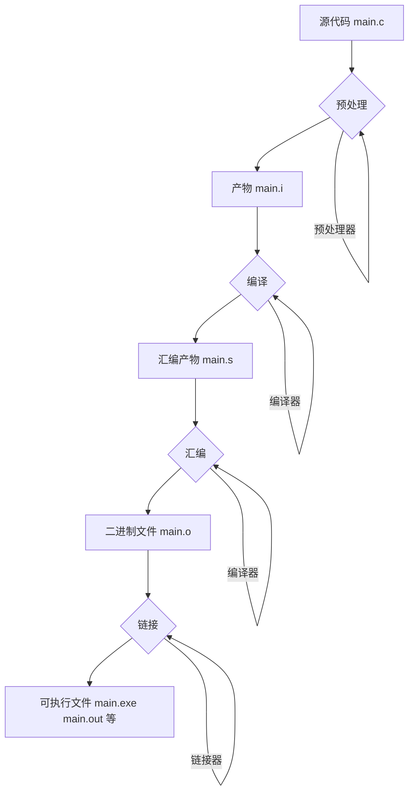

### C 程序编译过程

### 整体流程概况

源程序(.c) → 预处理 → 编译 → 汇编 → 链接





源代码：hello.c

```c
#include<stdio.h>
int main()
{
    printf("Hello World!"); // 打印 Hello World
    return 0;
}
```

终端执行命令（MacOS）：

```shell
$ ls
hello.c
$ gcc -save-temps hello.c -o hello
$ ls
hello	hello.c		hello.o
hello.bc	hello.i		hello.s
```

其中产物分别为（MacOS）：

```scss
- hello.i 预处理器产生的文件
- hello.s 编译器编译后产生的文件
- hello.o 汇编程序翻译后的目标文件
- hello.bc LLVM 编译器在编译过程中产生的中间代码（IR），最后将.bc文件转为可执行文件（有些平台可能没有）
- hello 可执行文件，后缀名可以根据系统设置(windows 产物hello.exe， Linux系统会产生hello.out文件)
```


### **1.预处理**

预处理操作

> ✦ 将所有的define 内容进行替换，然后删除define定义
>
> ✦ 处理条件编译指令 #if, #ifdef, #ifudef等，替换成满足条件的代码，其余删除
>
> ✦ 将#include 指向的头文件内容复制并插入到该行，替换#include 所在行
>
> ✦ 删除所有注释，保留#pragma编译指令
>
> ✦ 添加代码行号和文件位置标示
>
> ✦ 最终产物 .i 文件


单步骤预处理命令：

```shell
gcc -E hello.c -o hello.i
```


产物 hello.i 

```c
// 前面省略，直接拉到文件最尾部代码

extern int __vsnprintf_chk (char * restrict, size_t, int, size_t,
       const char * restrict, va_list);
# 400 "/Applications/Xcode.app/Contents/Developer/Platforms/MacOSX.platform/Developer/SDKs/MacOSX.sdk/usr/include/stdio.h" 2 3 4
# 2 "hello.c" 2
int main()
{
    printf("Hello World!");
    return 0;
}
```

可以看到:

> stdio.h 引用被替换成了真实路径
> 注射内容被删除了
> 还可以写其他代码试试


### **2.编译**

编译：将c语言翻译为汇编语言

> ✦ 词法分析
>
> （是编译过程的第一个阶段，词法分析的任务是一个字符一个字符地读入源码，把字符序列转化为单词（token）序列）
>
> ✦ 语法分析
>
> （任务是在词法分析的基础上将单词组合成各种“句子”（AST），有了“句子”计算机才能知道程序的含义）
>
> ✦ 语义分析
>
> （任务是进行类型检查，类型推导，隐式类型转换，常量表达式计算，运算符重载和函数重载。）
>
> ✦ 优化后生成相应的汇编代码. 从 **高级语言** → 低级**汇编语言** 产物 .s


单步骤生成汇编代码：

```shell
gcc -S hello.i -o hello.s
```


产物 hello.s (MacOS M1)

``` assembly
	.section	__TEXT,__text,regular,pure_instructions
	.build_version macos, 12, 0	sdk_version 12, 1
	.globl	_main                           ## -- Begin function main
	.p2align	4, 0x90
_main:                                  ## @main
	.cfi_startproc
## %bb.0:
	pushq	%rbp
	.cfi_def_cfa_offset 16
	.cfi_offset %rbp, -16
	movq	%rsp, %rbp
	.cfi_def_cfa_register %rbp
	subq	$16, %rsp
	movl	$0, -4(%rbp)
	leaq	L_.str(%rip), %rdi
	movb	$0, %al
	callq	_printf
	xorl	%eax, %eax
	addq	$16, %rsp
	popq	%rbp
	retq
	.cfi_endproc
                                        ## -- End function
	.section	__TEXT,__cstring,cstring_literals
L_.str:                                 ## @.str
	.asciz	"Hello World!"

.subsections_via_symbols

```


### **3.汇编**

汇编就是将汇编语言(指令集) 转成机器语言

汇编语言 → 机器语言 (**二进制**)


编译.s 至目标文件 .o ：

```shell
gcc -c hello.s -o hello.o
```


产物 hello.o

```c
cffa edfe 0700 0001 0300 0000 0100 0000
0400 0000 0802 0000 0020 0000 0000 0000
1900 0000 8801 0000 0000 0000 0000 0000
0000 0000 0000 0000 0000 0000 0000 0000
9800 0000 0000 0000 2802 0000 0000 0000

// 中间省略...

0041 0e10 8602 430d 0600 0000 0000 0000
1900 0000 0100 002d 1200 0000 0200 0015
0000 0000 0100 0006 0100 0000 0f01 0000
0000 0000 0000 0000 0700 0000 0100 0000
0000 0000 0000 0000 005f 6d61 696e 005f
7072 696e 7466 0000 
```


### **4.链接**

链接的作用如下：

> ✦ 当源程序很大时，可以将它分为多个源程序，通过编译可以形成 **多个目标文件(Unix: .o)**，这时我们需要用链接器把它们连接到一起，生成一个可执行文件；
>
> ✦ 程序中调用了某个库文件中的子程序, 需要将这个库文件和该程序生成的目标文件连接到一起，生成一个可执行文件；
>
> 链接器把多个二进制的目标文件（object file）链接成一个单独的可执行文件。在链接过程中，它必须把符号（变量名、函数名等一些列标识符）用对应的数据的内存地址（变量地址、函数地址等）替代，以完成程序中多个模块的外部引用。（静态链接和动态链接）
>
> 通过编译器的前3个步骤后，我们获得目标代码，但是里面的各个地址还没有确定，空间还没有分配。链接过程主要包括：地址和空间的分配，符号决议和重定位。
>
> ✦ 一个源程序编译后，得到了存有机器码的目标文件，目标文件中的有些内容还不能直接用来生成可执行文件，链接器程序将这些内容处理为最终的可执行信息. 所以，在只有一个源程序文件，而又不需要调用某个库中的子程序时，也必须用链接器对目标文件进行处理，生成可执行文件.


链接操作：

```shell
gcc hello.o -o hello

如果是Windows可以添加文件后缀：
gcc hello.o -o hello.exe
```

那么hello 就是最后的可执行文件

那么我们通过MachOView 来查看可执行文件结构：


上图在 TEXT 的 string 段发现我们源代码需要输出的字符串 “Hello World!”


### **运行**

Macos 运行可执行文件 hello  (可执行文件)

```shell
$ ./hello
Hello World!
```


### 附表  

GCC常用的编译选项

| gcc/g++指令选项 | 功 能                                    |
| --------------- | ---------------------------------------- |
| -E（大写）      | 预处理指定的源文件，不进行编译。         |
| -S（大写）      | 编译指定的源文件，但是不进行汇编。       |
| -c              | 编译、汇编指定的源文件，但是不进行链接。 |
| -o              | 指定生成文件的文件名。                   |

