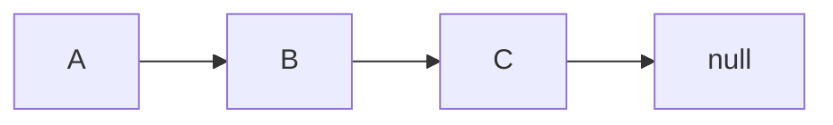
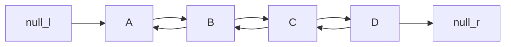
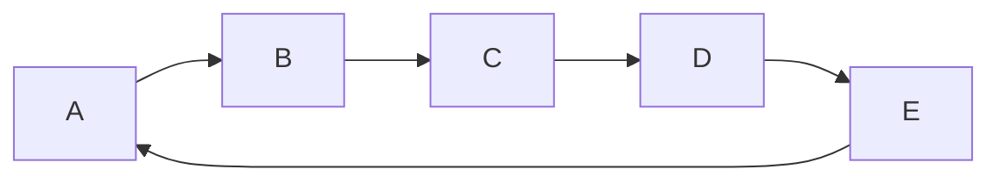
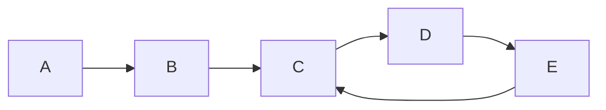
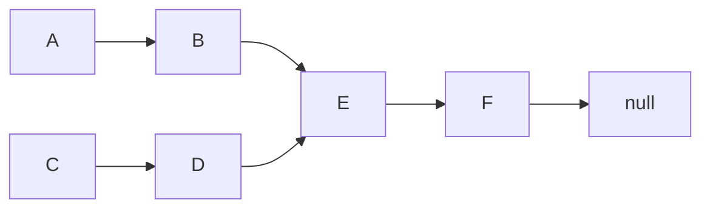
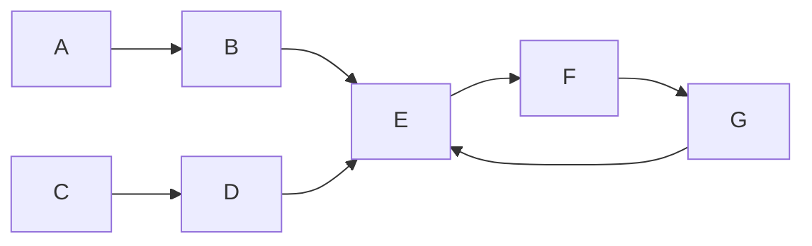

### 链表


::: tip 链表
1、物理存储上可以非连续的

2、数据元素的逻辑顺序通过链表中的指针链接次序，实现的一种线性存储结构。
:::

::: details 查看详情

链表由一系列节点（链表中每一个元素称为节点）组成，节点在运行时动态生成 （malloc），每个节点包括两个部分：

   一个是存储数据元素的**数据域**

   另一个是存储下一个节点地址的**指针域**

```
//定义结点结构体
typedef struct Node
{
    //数据域
    int num;		//序号
    //指针域
    struct Node *next; //下一个节点
    struct Node *pre; //前一个节点
}Nod;
```

:::

#### **单向链表**：

   链表最大的作用是通过节点把离散的数据链接在一起，常见单向链表是通过一个指针开始，向某一个方向移动，最终指向 null




**双向链表**：

​	双向链表与单向链表的区别就是节点中有两个节点指针，分别指向前后两个节点，一个往前移动，一个往后移动。




**环**：

1、整体是个环：圆形链表，首尾相连



2、后部分是环，指针从起点开始移动，最终会回到中间的某个节点，形成环




**链表相交：**

两条链表相交，一般指的是 两条 单向链表，相交的话说明尾部存在相同的连续节点


示例：


1、 相交-无环



1、 相交-有环





**单链表表示**

 返回头节点即可： Node *headNode;


